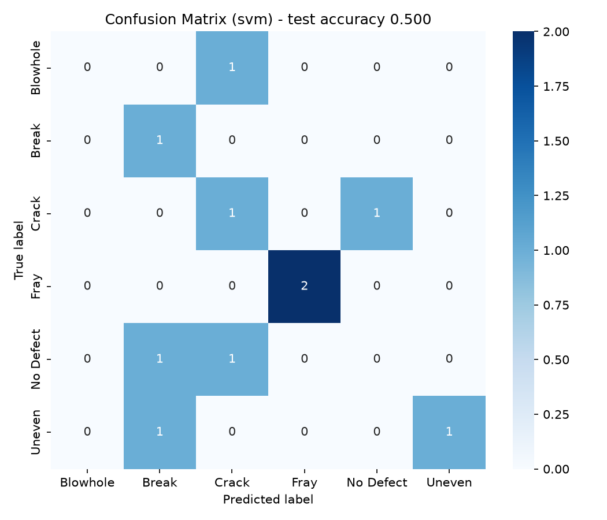

# 🔩 Metal Surface Defect Detection with Classical Computer Vision

A full pipeline that **classifies** metal surface images into 6 categories
(5 real defect types + "no defect") and **localizes** the defect region in
the image — built entirely on classical computer vision (OpenCV +
scikit-image) and classical machine learning (scikit-learn). No deep
learning / GPU required.

| | |
|---|---|
| **Task** | 6-class image classification + unsupervised defect localization |
| **Dataset** | [Magnetic Tile Defect Dataset](https://github.com/abin24/Magnetic-tile-defect-datasets.) (Huang et al., *Surface defect saliency of magnetic tile*, The Visual Computer, 2020) — 1,344 real industrial images with pixel-level ground truth masks |
| **Approach** | Hand-crafted features (HOG, LBP, GLCM, edge/contour stats) → SVM / Random Forest |
| **Result** | **94.1% test accuracy** (SVM, 5-fold CV mean 97.1% ± 1.4%) |
| **Demo** | Streamlit app — upload an image, get a class + localization overlay |

<p align="center"></p>

---

## Why classical CV instead of a CNN?

This project deliberately uses **hand-engineered features + a classical
classifier** rather than training a CNN end-to-end, because that's a real,
still-common engineering choice in industrial inspection:

- It works well with **small datasets** (hundreds of images per class, no
  GPU pretraining needed).
- It runs in **milliseconds on a CPU**, which matters when the model lives
  next to a camera on a production line, not in a datacenter.
- Every feature is **interpretable** — you can tell a quality engineer
  "the classifier flagged this because of high edge density and low local
  homogeneity," not just "the neural network said so."
- It's a good demonstration of actually understanding what's happening
  inside a vision pipeline, rather than only calling `model.fit()`.

The README below walks through every algorithm used and why it's there.
See [`Next steps`](#next-steps--known-limitations) for where a CNN /
U-Net would be the better choice.

---

## Pipeline overview

```
raw image (any size, grayscale)
        │
        ▼
┌───────────────────┐
│   Preprocessing    │  resize → Gaussian blur (denoise) → CLAHE (local contrast)
└───────────────────┘
        │
        ├──────────────────────────────┐
        ▼                              ▼
┌───────────────────┐        ┌──────────────────────┐
│ Feature extraction │        │ Unsupervised defect  │
│ HOG + LBP + GLCM +  │        │ localization: Otsu   │
│ edges/contours +    │        │ threshold + morph.   │
│ intensity stats     │        │ ops + contours        │
└───────────────────┘        └──────────────────────┘
        │                              │
        ▼                              ▼
┌───────────────────┐        bounding box(es) around
│  SVM / Random      │        the suspected defect
│  Forest classifier  │
└───────────────────┘
        │
        ▼
  predicted class (Blowhole / Break / Crack / Fray / Uneven / No Defect)
```

## The algorithms, explained

### 1. Preprocessing (`src/preprocessing.py`)
- **Resize** to 128×128 so every feature vector has the same length.
- **Gaussian blur** (3×3) removes sensor noise without erasing fine cracks.
- **CLAHE** (Contrast Limited Adaptive Histogram Equalization) boosts local
  contrast in tiles of the image, which makes low-contrast defects like
  hairline cracks and faint blowholes easier for every downstream step to
  pick up. Plain histogram equalization over-amplifies noise in flat
  regions — CLAHE avoids that by clipping the histogram per tile.

### 2. Feature extraction (`src/feature_extraction.py`)
Five complementary feature families are concatenated into one vector per
image (1,806 dimensions total in this configuration):

- **HOG (Histogram of Oriented Gradients).** Splits the image into cells,
  computes the gradient orientation at every pixel, and histograms
  orientations per cell. Captures *shape/structure* — a crack or break is
  essentially a strong, directional edge, so HOG is very informative for
  elongated defects.
- **LBP (Local Binary Patterns).** For each pixel, compares it against its
  circular neighborhood and encodes the brighter/darker pattern as a
  binary code, then histograms the codes over the image. Captures
  *texture* — this is what tells a rough "Uneven" surface apart from a
  smooth "No Defect" surface.
- **GLCM (Gray-Level Co-occurrence Matrix).** Counts how often pairs of
  gray levels occur next to each other at a given distance, then derives
  contrast, homogeneity, energy and correlation from that matrix. A
  second, noise-robust way to describe texture regularity.
- **Canny edges + contour statistics.** Canny finds edges via
  non-maximum suppression and hysteresis thresholding on the image
  gradient; `findContours` then groups edge pixels into blobs. We record
  edge density, blob count, and the largest blob's area/perimeter — an
  explicit "how much and how big is the anomaly" signal.
- **Global intensity statistics.** Mean, standard deviation and skewness
  of pixel intensity — blowholes and breaks are dark cavities, so these
  shift measurably.

### 3. Classification (`src/train.py`)
Two classical models are trained and compared:

- **SVM (RBF kernel).** Finds the maximum-margin decision boundary in a
  kernel-induced feature space. Strong default for a ~1,800-dimensional
  feature vector with a few hundred samples per class.
- **Random Forest.** An ensemble of decision trees trained on bootstrapped
  samples with randomized feature subsets; robust to feature scale and
  gives feature-importance rankings "for free."

Features are standardized (zero mean, unit variance) before SVM training,
since HOG/LBP/GLCM/edge features live on very different numeric scales and
SVM is scale-sensitive.

### 4. Unsupervised defect localization (`src/defect_localization.py`)
This part needs **no training** — it answers "*where*" the classifier's
"*what*" is happening, using classic image-processing only:

1. **Otsu's thresholding** automatically finds the gray-level threshold
   that best separates two intensity populations (surface vs. defect) by
   maximizing between-class variance.
2. **Morphological opening + closing** clean the binary mask: opening
   (erode→dilate) removes small noise specks, closing (dilate→erode)
   fills small holes inside a defect region.
3. **Contour detection** traces the boundary of each remaining blob;
   small blobs (< 25 px) are discarded as noise, and bounding boxes are
   drawn around what's left.

---

## Results

Trained on the full 1,344-image dataset (80/20 stratified split, 5-fold CV
on the training set):

| Model | 5-fold CV accuracy | Held-out test accuracy |
|---|---|---|
| **SVM (RBF)** | **97.1% ± 1.4%** | **94.1%** |
| Random Forest | 76.7% ± 1.5% | 77.7% |

SVM per-class performance (test set, `outputs/classification_report_svm.txt`):

| Class | Precision | Recall | F1 |
|---|---|---|---|
| Blowhole | 0.88 | 0.91 | 0.89 |
| Break | 0.91 | 0.59 | 0.71 |
| Crack | 1.00 | 0.82 | 0.90 |
| Fray | 0.80 | 0.67 | 0.73 |
| No Defect | 0.94 | 0.99 | 0.97 |
| Uneven | 1.00 | 0.95 | 0.98 |

The SVM comfortably outperforms the Random Forest here — with ~1,800
correlated, continuous features and a few hundred samples per class, a
margin-based method generalizes better than trees, which tend to overfit
on high-dimensional dense features without more aggressive tuning.

`Break` and `Fray` have the lowest recall, largely because they're the
rarest classes (85 and 32 images total) and visually overlap with `Blowhole`
and `Crack` in some samples — more training data or targeted augmentation
for these two classes would be the first lever to pull.

---

## Next steps / known limitations

Being upfront about this because it's a useful engineering signal:

- **Localization is the weak link.** The Otsu+morphology pipeline gets a
  mean IoU of only ~0.07 against the pixel-level ground truth masks
  (`outputs/localization_iou.txt`), because several defects (blowholes,
  cracks) occupy well under 1% of the image, and a single global threshold
  struggles with such small, low-contrast regions. A **U-Net-style semantic
  segmentation CNN**, or at least **adaptive/local thresholding**, would
  substantially improve this and is the natural next step.
- **Class imbalance.** "No Defect" has ~950 images vs. 32–115 for the rarer
  defect classes; `class_weight="balanced"` helps but more data or
  augmentation (rotation/flip — these images have no fixed orientation)
  would help more.
- **A CNN baseline** (e.g., a small ResNet fine-tuned on this data) would
  be a natural comparison point to show classical CV vs. deep learning
  trade-offs explicitly.

---

## Project structure

```
.
├── app.py                        # Streamlit demo
├── download_data.sh              # fetches the full dataset
├── requirements.txt
├── data/
│   ├── sample/                   # small subset, committed to the repo
│   └── full/                     # full dataset, gitignored — run download_data.sh
├── src/
│   ├── config.py                 # paths, class names, hyperparameters
│   ├── data_loader.py
│   ├── preprocessing.py
│   ├── feature_extraction.py     # HOG / LBP / GLCM / edges / stats
│   ├── defect_localization.py    # Otsu + morphology + contours
│   ├── train.py                  # trains + compares SVM / Random Forest
│   ├── predict.py                # single-image inference
│   └── evaluate_localization.py  # IoU against ground-truth masks
├── models/                       # trained model + scaler (committed)
├── outputs/                      # confusion matrices, reports (committed)
└── tests/
    └── test_pipeline.py
```

## Getting started

```bash
git clone <this-repo-url>
cd metal-defect-detection
pip install -r requirements.txt

# quick smoke test on the small sample already in the repo
python -m src.train --data data/sample

# for the real result, get the full dataset first
./download_data.sh
python -m src.train --data data/full

# classify a single image
python -m src.predict --image data/sample/MT_Crack/exp1_num_20362.jpg

# interactive demo
streamlit run app.py

# tests
pytest tests/
```

## Dataset attribution

Images from the **Magnetic Tile Defect Dataset**, released by the authors
of *"Surface defect saliency of magnetic tile"* (Huang, Y., Qiu, C., Yuan,
K., The Visual Computer, 2020). Used here for academic/portfolio purposes
only, per the dataset's terms — see the
[original repository](https://github.com/abin24/Magnetic-tile-defect-datasets.)
for details and citation info.
